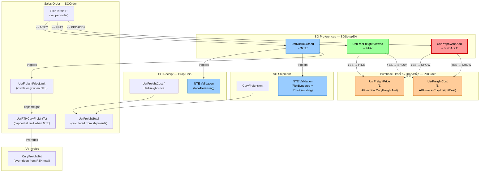

# Migration Report: "Prepay and Add" Field (UsrPrepayAndAdd)

**Source Version:** 24.112.006  
**Date:** February 19, 2026  
**Field:** `SOSetupExt.UsrPrepayAndAdd`  
**Screen:** Sales Orders Preferences (SO101000) → Invoice Settings → "Prepay and Add"  
**Current Value:** `PPDADD - Prepaid and Add`  

---

## Executive Summary

The **"Prepay and Add"** field is a **Ship Terms ID reference** stored on the `SOSetup` extension. It acts as a **configuration identifier** that the system uses to recognize which shipping terms represent the "Prepay and Add" freight model. When a Sales Order's `ShipTermsID` matches this configured value, the system **controls field visibility on Purchase Orders** — specifically showing freight cost and freight price columns on drop-ship PO screens. 

It does **NOT** enforce freight caps, trigger validations, or modify calculations. Its role is purely **UI visibility control** on PO Order forms.

---

## Table of Contents

1. [Field Definition](#1-field-definition)
2. [Data Flow Diagram](#2-data-flow-diagram)
3. [Functional Behavior](#3-functional-behavior)
4. [Comparison with Related Ship Terms Fields](#4-comparison-with-related-ship-terms-fields)  
5. [Code References](#5-code-references)
6. [PO Order Visibility Matrix](#6-po-order-visibility-matrix)
7. [Known Discrepancy](#7-known-discrepancy-rowselecting-vs-rowselected)
8. [Verification Checklist for New Version](#8-verification-checklist-for-new-version)

---

## 1. Field Definition

### DAC Extension: `SOSetupExt` (on `PX.Objects.SO.SOSetup`)

**File:** `App_Data/Projects/CompiledVersion/CompiledVersion/DACExt/SOSetupExt.cs` (Lines 20–27)

```csharp
#region UsrPrepayAndAdd
[PXDBString(10, IsUnicode = true, InputMask = ">aaaaaaaaaa")]
[PXUIField(DisplayName = "Prepay and Add")]
[PXDefault(PersistingCheck = PXPersistingCheck.Nothing)]
[PXSelector(typeof(ShipTerms.shipTermsID), DescriptionField = typeof(ShipTerms.description), CacheGlobal = true)]
public string UsrPrepayAndAdd { get; set; }
public abstract class usrPrepayAndAdd : PX.Data.BQL.BqlString.Field<usrPrepayAndAdd> { }
#endregion
```

**Key Properties:**
| Property | Value |
|----------|-------|
| Field Type | `PXDBString(10)` — persisted in database |
| Data Source | `ShipTerms.shipTermsID` selector |
| Display Name | "Prepay and Add" |
| Default | None (optional field) |
| Location on Screen | SO Preferences → General tab → Invoice Settings section |

---

## 2. Data Flow Diagram



### Simplified Flow (PrepayAndAdd only)

```
┌─────────────────────────────────────────────────────────────────────┐
│                    SO Preferences (SOSetupExt)                      │
│                    UsrPrepayAndAdd = "PPDADD"                       │
└────────────────────────────┬────────────────────────────────────────┘
                             │
                             ▼
┌─────────────────────────────────────────────────────────────────────┐
│                 Sales Order (SOOrder)                               │
│                 ShipTermsID = "PPDADD"                              │
│                 (matches UsrPrepayAndAdd)                           │
└────────────────────────────┬────────────────────────────────────────┘
                             │
                             ▼
┌─────────────────────────────────────────────────────────────────────┐
│               Drop-Ship PO Order (POOrderEntry)                     │
│                                                                     │
│   RowSelecting<POLine>:                                             │
│     ├─ UsrShowFreightCost  = TRUE  (PPA || FFA)                    │
│     └─ UsrShowFreightPrice = FALSE (FFA only)                      │
│                                                                     │
│   RowSelected<POOrder>:                                             │
│     ├─ usrFreightCost  VISIBLE  (PPA || FFA)                       │
│     └─ usrFreightPrice VISIBLE  (PPA only) ← actual UI control    │
│                                                                     │
│   FieldSelecting:                                                   │
│     ├─ usrFreightCost  = Σ ARInvoice.CuryFreightCost              │
│     └─ usrFreightPrice = Σ ARInvoice.CuryFreightAmt               │
└─────────────────────────────────────────────────────────────────────┘
```

---

## 3. Functional Behavior

### What the Field Does

1. **Stores a Ship Terms ID** — The field holds a reference to a `ShipTerms` record (e.g., `PPDADD`). This is configured once in SO Preferences and remains constant unless explicitly changed.

2. **Controls PO Order UI Visibility** — When a drop-ship Purchase Order is linked to a Sales Order, the system compares `SOOrder.ShipTermsID` against `SOSetupExt.UsrPrepayAndAdd`:
   - **Match → Show** `UsrFreightCost` (aggregated freight cost from linked AR invoices)
   - **Match → Show** `UsrFreightPrice` (aggregated freight amount from linked AR invoices)

3. **Calculated Fields on PO** — The freight cost and price displayed are **unbound computed fields** that aggregate data from AR Invoices:
   - `UsrFreightCost` = Sum of `ARInvoice.CuryFreightCost` across all invoices linked to the same SO
   - `UsrFreightPrice` = Sum of `ARInvoice.CuryFreightAmt` across all invoices linked to the same SO

### What the Field Does NOT Do

- **No freight validation or enforcement** — Unlike `UsrNotToExceed`, there is no cap or limit
- **No freight calculation modification** — The field doesn't change how freight is computed
- **No impact on invoices** — Does not affect `SOInvoiceEntry` freight override logic
- **No impact on shipments** — Does not participate in `SOShipmentEntry` freight handling  
- **No impact on RTH calculations** — `RecalculateRthCuryOrderTotal` is driven by `UsrFreightPriceLimit` (NTE), not PrepayAndAdd

### Business Meaning

"Prepay and Add" is a standard freight arrangement where:
- The **vendor prepays** the freight charges
- The vendor then **adds** the freight cost to the purchase invoice
- The system needs to track **both** the freight cost (what the vendor paid) **and** the freight price (what gets charged forward) on the PO

This is why both `UsrFreightCost` AND `UsrFreightPrice` are shown for Prepay and Add orders — the buyer needs visibility into both amounts.

---

## 4. Comparison with Related Ship Terms Fields

All three fields are configured identically in `SOSetupExt` — they are `PXDBString(10)` selectors pointing to `ShipTerms`. Their impact differs:

| Behavior | `UsrPrepayAndAdd` | `UsrFreeFreightAllowed` | `UsrNotToExceed` |
|----------|:-:|:-:|:-:|
| PO: Show `UsrFreightCost` | **Yes** | **Yes** | No |
| PO: Show `UsrFreightPrice` | **Yes** | **No** | No |
| SO: Show `UsrFreightPriceLimit` | No | No | **Yes** |
| Shipment: NTE freight cap enforcement | No | No | **Yes** |
| Receipt: NTE freight validation | No | No | **Yes** |
| Invoice: Override `CuryFreightTot` | No | No | **Yes** (via RTH) |
| Shipment: `CuryPremiumFreightAmt` update | No | No | **Yes** |
| RTH: Cap freight in order total | No | No | **Yes** |

### Logic Summary

```
IF SOOrder.ShipTermsID == SOSetupExt.UsrPrepayAndAdd:
    → PO Order: Show FreightCost ✓, Show FreightPrice ✓
    → No validation, no enforcement, no caps
    → Business: Vendor prepays freight and adds to invoice — track both cost and price

IF SOOrder.ShipTermsID == SOSetupExt.UsrFreeFreightAllowed:
    → PO Order: Show FreightCost ✓, Hide FreightPrice ✗
    → No validation, no enforcement, no caps
    → Business: Customer gets free freight — track cost only (not charged to customer)

IF SOOrder.ShipTermsID == SOSetupExt.UsrNotToExceed:
    → PO Order: Hide FreightCost ✗, Hide FreightPrice ✗
    → SO: Show FreightPriceLimit field
    → Shipment/Receipt: Validate freight ≤ FreightPriceLimit
    → RTH: Cap freight component at limit in order total
    → Invoice: Override CuryFreightTot with RTH freight total
    → Business: Freight is capped at a maximum — enforce and track the cap

IF SOOrder.ShipTermsID == anything else:
    → PO Order: Hide FreightCost ✗, Hide FreightPrice ✗
    → Standard freight behavior
```

---

## 5. Code References

### Files That Reference `UsrPrepayAndAdd`

| # | File | Location | Purpose |
|---|------|----------|---------|
| 1 | `DACExt/SOSetupExt.cs` | Lines 20–27 | Field definition |
| 2 | `GraphExt/POOrderEntry_Extension.cs` | Lines 922, 931 | `RowSelecting<POLine>`: Sets `UsrShowFreightCost` flag |
| 3 | `GraphExt/POOrderEntry_Extension.cs` | Lines 1184–1187 | `RowSelected<POOrder>`: Controls `usrFreightCost` and `usrFreightPrice` visibility |

### Files with Related Freight Fields (NOT directly using UsrPrepayAndAdd)

| # | File | Purpose |
|---|------|---------|
| 4 | `DACExt/POOrderExt.cs` | Defines `UsrFreightCost`, `UsrFreightPrice`, `UsrShowFreightCost`, `UsrShowFreightPrice` |
| 5 | `DACExt/SOOrderExt.cs` | Defines `UsrFreightPriceLimit`, `UsrFreightTotal`, `UsrRTHCuryFreightTot` |
| 6 | `DACExt/POReceiptExt.cs` | Defines `UsrFreightCost`, `UsrFreightPrice` on receipts |
| 7 | `GraphExt/POOrderEntry_Extension.cs` | `FieldSelecting` handlers compute freight from AR Invoices |
| 8 | `GraphExt/SOShipmentEntry_Extension.cs` | `ConfirmShipment`, NTE validation |
| 9 | `GraphExt/SOOrderEntry_Extension.cs` | `UsrFreightTotal` FieldSelecting, RTH calculations |
| 10 | `GraphExt/SOInvoiceEntry_Extension.cs` | Invoice freight override from RTH |
| 11 | `GraphExt/POReceiptEntry_Extension.cs` | NTE validation on PO Receipt save |

**All files under base path:** `App_Data/Projects/CompiledVersion/CompiledVersion/`

---

## 6. PO Order Visibility Matrix

### `RowSelecting<POLine>` — Sets Runtime Flags

```csharp
// File: GraphExt/POOrderEntry_Extension.cs, Lines 931–933
poExt.UsrShowFreightCost = sOSetupExt.UsrPrepayAndAdd == soOrder.ShipTermsID ||
                            sOSetupExt.UsrFreeFreightAllowed == soOrder.ShipTermsID;
poExt.UsrShowFreightPrice = sOSetupExt.UsrFreeFreightAllowed == soOrder.ShipTermsID;
```

### `RowSelected<POOrder>` — Sets Actual UI Visibility (takes precedence)

```csharp
// File: GraphExt/POOrderEntry_Extension.cs, Lines 1184–1188
PXUIFieldAttribute.SetVisible<POOrderExt.usrFreightCost>(...,
    sOSetupExt.UsrPrepayAndAdd == soOrder.ShipTermsID ||
    sOSetupExt.UsrFreeFreightAllowed == soOrder.ShipTermsID);
PXUIFieldAttribute.SetVisible<POOrderExt.usrFreightPrice>(...,
    sOSetupExt.UsrPrepayAndAdd == soOrder.ShipTermsID);
```

### Resulting Visibility

| SO ShipTermsID Matches | `UsrFreightCost` on PO | `UsrFreightPrice` on PO |
|------------------------|:----------------------:|:-----------------------:|
| `UsrPrepayAndAdd` (PPDADD) | **VISIBLE** | **VISIBLE** |
| `UsrFreeFreightAllowed` (FFA) | **VISIBLE** | HIDDEN |
| `UsrNotToExceed` (NTE) | HIDDEN | HIDDEN |
| Other | HIDDEN | HIDDEN |

### Computed Values Behind the Fields

```csharp
// FieldSelecting: usrFreightCost — Lines 1058–1117
// Joins: POOrder → DropShipLink → SOOrder → SOOrderShipment → ARInvoice
// Returns: Σ ARInvoice.CuryFreightCost

// FieldSelecting: usrFreightPrice — Lines 1119–1168
// Joins: POOrder → DropShipLink → SOOrder → SOOrderShipment → ARInvoice
// Returns: Σ ARInvoice.CuryFreightAmt
```

---

## 7. Known Discrepancy: RowSelecting vs RowSelected

There is an **inconsistency** between two event handlers in `POOrderEntry_Extension.cs`:

| Event | `UsrShowFreightPrice` / FreightPrice Visible When |
|-------|--------------------------------------------------|
| `RowSelecting<POLine>` (line 933) | `UsrFreeFreightAllowed == ShipTermsID` |
| `RowSelected<POOrder>` (line 1187) | `UsrPrepayAndAdd == ShipTermsID` |

These conditions are **opposites**:
- `RowSelecting` sets the unbound flag `UsrShowFreightPrice = true` for **FreeFreightAllowed only**
- `RowSelected` sets actual UI visibility for `usrFreightPrice` for **PrepayAndAdd only**

**Impact:** The `RowSelected` handler controls the actual UI via `PXUIFieldAttribute.SetVisible`, so the **actual behavior** is that `UsrFreightPrice` is visible for **PrepayAndAdd** orders. The `UsrShowFreightPrice` unbound flag from `RowSelecting` appears to be **unused or overridden** by the `RowSelected` visibility control.

**When verifying the new version:** Ensure this same effective behavior is preserved — `UsrFreightPrice` should be visible on POs linked to PrepayAndAdd orders, NOT FreeFreightAllowed orders.

---

## 8. Verification Checklist for New Version

Use this checklist to verify the "Prepay and Add" field functions identically in the new version:

### A. Configuration (SO Preferences)
- [ ] Field "Prepay and Add" exists on SO Preferences → General → Invoice Settings
- [ ] Field is a selector referencing `ShipTerms` records
- [ ] Value `PPDADD` (or equivalent) can be selected and saved
- [ ] Field persists correctly (reopen screen, value retained)

### B. PO Order — Drop Ship Visibility
- [ ] Create a Sales Order with `ShipTermsID = PPDADD` (matching the configured Prepay and Add value)
- [ ] Create a Drop-Ship PO from the Sales Order
- [ ] On the PO Order, verify `UsrFreightCost` field is **VISIBLE**
- [ ] On the PO Order, verify `UsrFreightPrice` field is **VISIBLE**
- [ ] Create an SO Invoice/Shipment to generate AR Invoice with freight
- [ ] Verify `UsrFreightCost` shows the sum of `ARInvoice.CuryFreightCost` from linked invoices
- [ ] Verify `UsrFreightPrice` shows the sum of `ARInvoice.CuryFreightAmt` from linked invoices

### C. Negative Tests — FreeFreightAllowed Comparison
- [ ] Create a Sales Order with `ShipTermsID = FFA` (matching Free Freight Allowed)
- [ ] Create a Drop-Ship PO from the Sales Order
- [ ] Verify `UsrFreightCost` is **VISIBLE**
- [ ] Verify `UsrFreightPrice` is **HIDDEN**

### D. Negative Tests — Other Ship Terms
- [ ] Create a Sales Order with any other `ShipTermsID` (not PPDADD, FFA, or NTE)
- [ ] Create a Drop-Ship PO
- [ ] Verify both `UsrFreightCost` and `UsrFreightPrice` are **HIDDEN**

### E. No Freight Enforcement
- [ ] Verify that PrepayAndAdd orders do NOT trigger any freight limit validation on shipments
- [ ] Verify that PrepayAndAdd orders do NOT trigger any freight limit validation on PO receipts
- [ ] Verify that `UsrFreightPriceLimit` field is NOT visible on Sales Orders with PrepayAndAdd shipping terms

### F. Functional Equivalence (New vs Old)

The following functional behaviors must match:

| Requirement | Expected Behavior |
|-------------|-------------------|
| Field definition | `PXDBString(10)` selector on `ShipTerms.shipTermsID` |
| Display name | "Prepay and Add" |
| PO FreightCost visibility | Visible when `SO.ShipTermsID == UsrPrepayAndAdd OR UsrFreeFreightAllowed` |
| PO FreightPrice visibility | Visible when `SO.ShipTermsID == UsrPrepayAndAdd` only |
| FreightCost calculation | Sum of `ARInvoice.CuryFreightCost` from all linked invoices via DropShipLink → SO → SOOrderShipment → ARInvoice |
| FreightPrice calculation | Sum of `ARInvoice.CuryFreightAmt` from all linked invoices via same join path |
| No NTE enforcement | Must NOT trigger freight caps or validation errors |
| No RTH impact | Must NOT modify the RTH order total calculation |

---

## Appendix: Related Migration Guides

This field is part of the broader **Freight Customization** feature. Related migration guides:

| Guide | Focus |
|-------|-------|
| `Migration_NTE_Freight_Validation_to_25R2_2026-01-10.md` | NTE validation moved from PO Order to PO Receipt / SO Shipment save |
| `Migration_01-06-2026.md` | NTE freight validation changes summary |
| `Migration_Guide_2025R2.md` | Full 2025 R2 migration (all features) |
| `Migration_12-29-2025.md` | Graph extension changes for 12/29 changeset |

> **Note:** The NTE migration guides focus on `UsrNotToExceed` behavior, not `UsrPrepayAndAdd`. However, they share the same `SOSetupExt` and `POOrderEntry_Extension` code base, so changes to one may affect the other.
